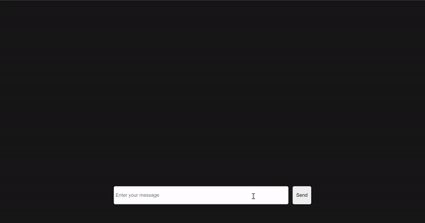

# Server-Sent Events: Stream "events" from server to client

## About

This is a demo repo that uses [Server-Sent Events](https://developer.mozilla.org/en-US/docs/Web/API/Server-sent_events), the specific use case being a Chat Application with Streaming Response from server. The repo contains implementations for Vannila js and React.

## Built with    

- [React](https://react.dev/)
- Vanilla Javascript
- [Python (FastAPI)](https://fastapi.tiangolo.com/)
- [fetch-event-source](https://www.npmjs.com/package/@microsoft/fetch-event-source)

## Demo

## Get it running

1. Clone the repo:
`git clone https://github.com/9akashnp8/learn-server-sent-events.git`

2. Run `docker compose up` to get all the services up and running. The react client can be access via localhost:**5173** and vanilla-js-client via localhost:**5174**
